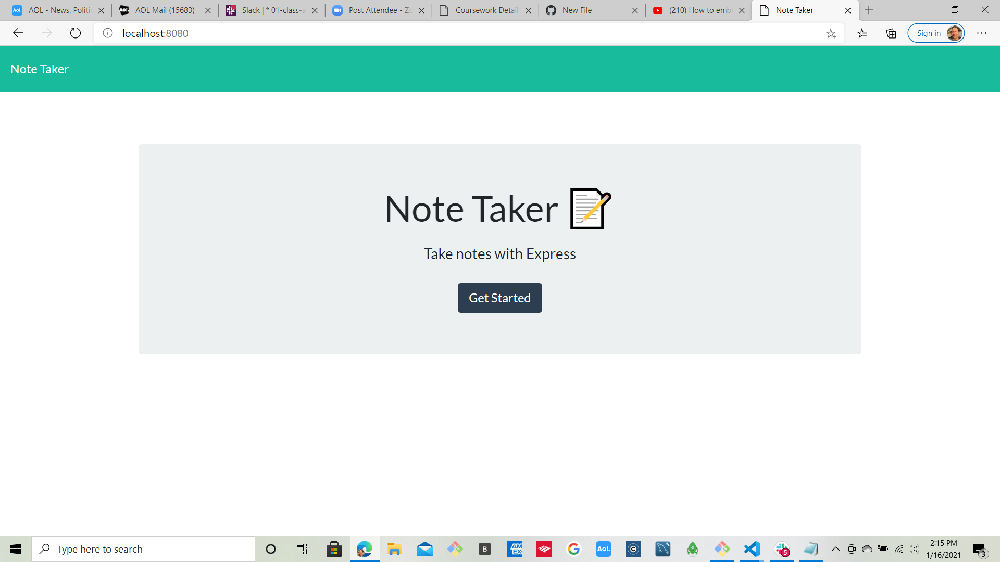
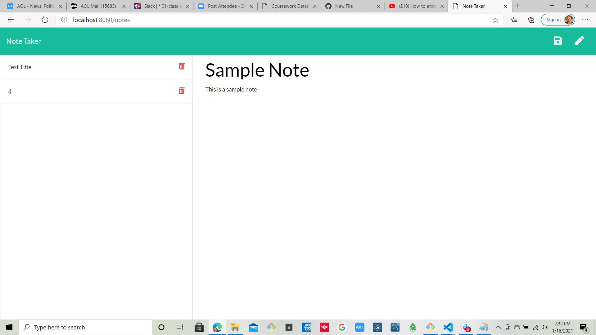
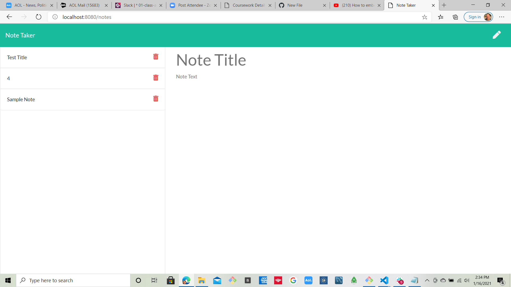
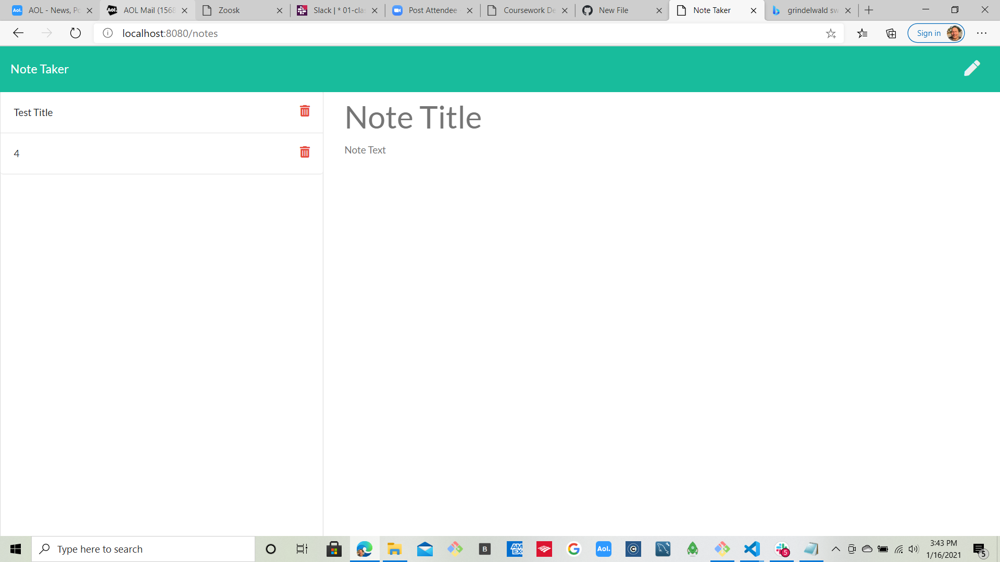

## Objective

To create an application where user can create / modify / delete notes

## Tools used:

Understanding of Route functionality ( "GET/POST/DELETE") and how it retrieve/insert/delete information from
a JSON by user directive . Express / MideleWare /static directory
were also utilized in this project

## Notes Project Screen Shots

## Create Note Start Page:

## Create NOte

## Note Created

## Note Deleted

## Transmission of information

## 3 different types of api routes were used in the project:

a) GET to retrieve information from JSON file
b) POST to send newly created notes to JSON FILE
C) PUT TO update already established notes

## Ajax processing ( functions ) for this project included:

a) GET
B) POST
C) DELETE

## 2 html routes also utilized

a) get route to retrieve information from JSON DB and display
to notes and index.html

## Enhancements

This project can be enhanced by storing date / time along with note to give user
an indication of how long this note has been stored and the need to delete when needed. JSON could be replaced by SQL if long term storage would be needed.
